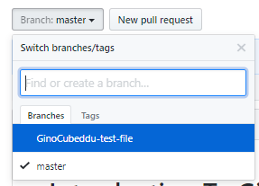
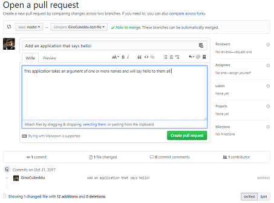

# Introduction To Git & GitHub

## A Note on Vim

Throughout this workshop you will be working with `git` on the command line. Sometimes that involves using the editor known as `vim`. There are only three basic things you need to know about this program:

* When you enter vim press `i` on your keyboard to make it editable
* To exit edit mode press `esc`
* To exit vim and save your work type `:wq` while **NOT** in edit mode
* Tp exit vim and **NOT** save your work type `:q!` while **NOT** in edit mode.

Don't worry, you will only have to use this for a very small part.

## Getting Started

Before we start anything locally we need to get a remote repo set up on GitHub. In order to do this we need [sign in](https://github.com/login) to GitHub. Once signed in and on GitHub's home page you should be able to see a button that says "New Repository" or "Start a project". If you are unable to see these buttons simply go [here](https://github.com/new).

Once on this page you will be able to decide a few things about your new project.
1. The name of your repo
2. A brief description of what the repo holds
3. Decide to make it Public or Private
4. Decide to initialize the repo with a README

In this case we want to name the new project something like "MyFirstRepo", give it a one line description, make it public and choose to initialize it with a README. At this point we are able to set things up on your local machine.

## Setting Up Locally

This introduction will be covering how to interact with Git and GitHub through the terminal and not the GitHub Desktop application. The reasoning behind this is that you have more control over what you can do and to give you a brief introduction to the terminal, a tool that will be useful throughout your career as a developer.

### Installing Git

The university machines already have the tools needed to do the required tasks however these instructions provide a point of interest for installing git at home.

#### Windows

Git for windows can be downloaded at their website [here](https://git-scm.com/downloads). This will install both git bash and the git GUI tool.

#### Mac

Git is easily installed on mac through a [Brew](https://brew.sh/) command. To do this simply open the terminal and type the following command.

```shell
brew install git
```

If you do not have Brew installed you can download it by following the instructions on their [website](https://brew.sh/).

#### Linux (Debian Based)

Again as on Mac Git is easily installed on Linux through the terminal but without the help of a 3rd party installer. On Linux simply open the terminal and type the following commands.

```shell
sudo apt-get update
sudo apt-get install git
```

Command Breakdown

* `sudo` - This tells the terminal to run the command with admin privileges
* `apt-get` - apt is the package manager for Debian based Linux systems.  

## Exercise one

Please complete the [Getting Started](#getting-started) section first.

### Setting Up Git

Now that git has been installed on your local machine the first thing that we need to do is tell git who you are. To start open the terminal (Git Bash for windows) and type the following commands.

```shell
git config --global user.name "Your Username"
git config --global user.email "Your Email"
```

 **Command Breakdown**

* `git` - The tool that we are using

* `config` - The sub command of the tool which handles its config

* `--global` - An Argument telling git that this information should be used in every session

* `user.name` - The config option for telling git what your name is

* `user.email` - The config option for telling git what your email is


Now that git knows who you are it is time for us to set up authorisation between your computer and GitHub. For this we are going to use a SSH key as discussed within the presentation. To do this enter the following command into your terminal and press the return key for each step.

```shell
ssh-keygen -t rsa -b 4096 -C "YOUR_EMAIL"
```

**Command Breakdown**

* `ssh-keygen` - The tool for creating ssh keys

* `-t` - This stands for the type of encryption we want to use

* `-b` - This stands for how strong we want to make our encryption (4096 is the standard)

Once the key has been generated you will be able to find it in your newly created ssh directory. To access the key use the following command which will output it to the terminal. Once you have the key go [here](https://github.com/settings/keys), click "New SSH key" and add the key.

```shell
cat ~/.ssh/id_rsa.pub
```

**Command Breakdown**

* `cat` - The tool for outputting the contents of a file to your screen

* `~/.ssh/id_rsa.pub` - The location of the file to be read


If everything went according to plan we should now be able to move onto cloning your repo.

### Cloning your Repository

To clone your repo type the following into the terminal.

```shell
cd ~/Desktop
mkdir repos
cd repos
git clone git@github.com:YOUR_GITHUB_USERNAME/REPO_NAME
```

**Command Breakdown**

* `cd ~/Desktop` - cd stands for "change directory" and the `~/Desktop` means go to the desktop
* `mkdir repos` - `mkdir` stands for "make directory" and `repos` is the name of the directory we will make
* `cd repos` - tells the terminal to enter the directory we just created on the desktop.
* `git clone` - This tells git to "clone" your remote repo which pulls it down for local use
* `git@github.com:YOUR_GITHUB_USERNAME/REPO_NAME` - This is the location of your remote repo

### Making A Change

Now that we have cloned the repo it is time to make our first change! To do so follow the instructions below.

1. Change directory to the repo we just cloned.

   ```shell
   Gino@Gino-PC ~/Desktop/repos
   $ cd MyFirstRepo/
   ```

2. Create a file called "aboutme.txt" using the `touch` command. The `touch` command creates an empty file with the name we provide.

   ```shell
   Gino@Gino-PC MINGW64 ~/Desktop/repos/MyFirstRepo (master)
   $ touch aboutme.txt
   ```

3. `echo` a short sentence into the file or edit the file by navigating to it in the explorer. `echo` is a command that tells the terminal to input a line of text into a file.
   **NOTE**: When using `echo` with one `>` it will overwrite everything in the file however if you use two `>>` it will append the echo to the end of the file.

   ```shell
   Gino@Gino-PC MINGW64 ~/Desktop/repos/MyFirstRepo (master)
   $ echo "Hello my name is Gino" > aboutme.txt
   ```

4. Now that we have made a change to the repo we can check its status through the `git status` command. The status command will tell us what is "staged" and what is not. When something is staged it means it will be included in your next commit.

   ```shell
   Gino@Gino-PC MINGW64 ~/Desktop/repos/MyFirstRepo (master)
   $ git status
   On branch master
   Your branch is up-to-date with 'origin/master'.
   Untracked files:
     (use "git add <file>..." to include in what will be committed)

           aboutme.txt

   nothing added to commit but untracked files present (use "git add" to track)
   ```

   Notice that it tells us that our file is untracked this means that it will not be included within our commit.

5. To fix this we need to use the `git add` command to "add" it to the next commit.

   ```shell
   Gino@Gino-PC MINGW64 ~/Desktop/repos/MyFirstRepo (master)
   $ git add aboutme.txt
   ```

6. Now that we have added the file lets check the status again.

   ```shell
   Gino@Gino-PC MINGW64 ~/Desktop/repos/MyFirstRepo (master)
   $ git status
   On branch master
   Your branch is up-to-date with 'origin/master'.
   Changes to be committed:
     (use "git reset HEAD <file>..." to unstage)

           new file:   aboutme.txt
   ```

   Notice that this time the file comes under the "Changes to be committed" list and git has noticed that it was a totally new file.

7. Since we are now sure that the file will be committed we can use the `git commit` command in order to "commit" the changes with a message. A "commit" is a record of the changes that you have just made. A commit can be made up of a single file or hundreds of files.

   ```shell
   Gino@Gino-PC MINGW64 ~/Desktop/repos/MyFirstRepo (master)
   $ git commit -m "Added my bio to a text file"
   [master 763e052] Added my bio to a text file
    1 file changed, 0 insertions(+), 0 deletions(-)
    create mode 100644 aboutme.txt
   ```

8. Now that we have committed our change lets push it back to the remote repo on GitHub. To do this we will use the `git push` command. This command tells git to push it back to the remote repository.

   ```shell
   Gino@Gino-PC MINGW64 ~/Desktop/repos/MyFirstRepo (master)
   $ git push origin master
   Counting objects: 3, done.
   Delta compression using up to 8 threads.
   Compressing objects: 100% (2/2), done.
   Writing objects: 100% (3/3), 298 bytes | 0 bytes/s, done.
   Total 3 (delta 0), reused 0 (delta 0)
   To git@github.com:GinoCubeddu/MyFirstRepo
      0904c1f..763e052  master -> master
   ```

   Notice that I added the words `origin master`. The word `origin` means push to where we got the repo from (Which was your repo on GitHub) and the word `master` is the branch we are pushing to which in this case is called master. **NOTE**: When working on projects you should be working on separate branches and not on the master branch.

9. Now that we have created the file and pushed it you should be able to see it within your GitHub repo.

## Exercise two

In this exercise we will experience working on a repository with other people. This includes doing your work on your own branches that will be merged into master at a later date instead of everyone just working on the master branch as that can get messy. It will also introduce you to opening a pull request on a repo and the code review process.

To start with everyone should have filled out the [google form](https://docs.google.com/forms/d/e/1FAIpQLSfORqcDrZuOXfYstzrBHPvG4768ha4K7BDQqw9dEd1FQ0pAKw/viewform?usp=sf_link) informing me of your GitHub username so I can give you write permissions.

Since we have already setup your local git instance we can jump straight into cloning the repo to your local machine.

 ```shell
Gino@Gino-PC MINGW64 ~/Desktop/repos
$ git clone git@github.com:GinoCubeddu/Worcester-Future-Week-Git-Talk
Cloning into 'Worcester-Future-Week-Git-Talk'...
remote: Counting objects: 6, done.
remote: Compressing objects: 100% (3/3), done.
remote: Total 6 (delta 0), reused 6 (delta 0), pack-reused 0
Receiving objects: 100% (6/6), done.
Checking connectivity... done.
 ```

It is important to note that you need to use my username for the cloning and not your own. This is because the remote repository is stored under my personal account.

Now that we have the repository cloned we should `checkout` to a new branch. When I say `checkout` that means we want to swap to a different branch to work on. There are two ways to do this:

**Way 1**

```shell
git branch $BRANCH_NAME
git checkout $BRANCH_NAME
```

**Command breakdown**

* `git branch $BRANCH_NAME` - This tells git that we want to create a branch with the passed in branch_name
* `git checkout $BRANCH_NAME` - This tells git to checkout to the branch that we just created.

**Way 2**

The second way only requires a single command which allows you to save time.

```shell
git checkout -b $BRANCH_NAME
```

Notice the `-b` after the `git checkout` this is basically telling git to create a new branch before checking out to it. Note that if you attempt to change to a branch that exists when using the `-b` argument you will receive an error.

When you are on your own branch (You can check what branch you are on by typing `git branch`) open the project directory in your favroute text editor and create a file with any extension (such as `html`, `css`, `php`, `cs`, `py`, etc) in the `submissions` folder called "USERNAME_YEAR" and add some context to it.

**Helpful Hint:** If you have a text editor such as atom installed on your machine you are able to open the project directory from the command line through this command:

```shell
atom .
```

**Command Breakdown**

* `atom` - Tells the terminal to use the atom text editor to open a file/folder
* `.` - This means open the current directory, this can be switched out with a file or folder name

Once you have created your folder we are ready to commit and push the file as we did in steps `4-8` in the previous exercise. The process was as follows:

1. Check the current status of your local repo
2. Add the files that you want to commit that are unstaged
3. Check the status again to ensure the correct files have been added
4. Commit the file(s) with a useful message
5. Push your files to the remote repository (**NOTE:** Push to your branch and not the master branch)

If everything went well you should be able to see your branch on the remote GitHub Repository and be able to open a pull request against the master branch in order to merge your changes. To do this follow these steps:

1. Open the GitHub Repo and switch branch by clicking on the branch dropdown and select your branch name as shown below:

   

2. Once you are on your branch you should be able to see your file within the `submissions` folder. If you are indeed able to see your file you are ready to make a pull Request. In order to do this click the button that says "New pull request" next to the branch name drop down.

3. This should take you to a page to open a pull request where you are able to review your changes, name the pull request and give a brief description before opening the pull request.
   

4. Once you click "Create pull request" you will be taken to the pull request page where people will be able to comment, approve or deny your request. If you go away from this page it is easily accessible again through the pull requests tab.

The final part of this exercise requires to open up the Pull Request of the person sat next to you, look at the files they have changed and leave a comment on their code. Once you have done that approve their pull request. This can be done by clicking on the "review changes" button on the files tab. **Note:** You are able to leave a comment on a certain line of code by clicking on the `+` at the beginning of the line.


Once your request has been approved go ahead and merge it.

## Exercise Three

Now that we have covered the basics of git and GitHub it is time for you to create a git repository for your game engines. Within your teams decide who's profile will hold the engine and create a repo for it on GitHub. Once created invite everyone on your team as a collaborator allowing you all to edit it.

## Exercise Four (Advanced)

So far in this workshop we have gotten you set up with git, created your first repo and have had experience working with some branches. For this final exercise we are going to manipulate the commit history of a branch.

Manipulating your commit history is extremely useful but can be dangerous if you don't know what you are doing. Lets take this chance to cover the basics of using the `rebase` tool that is included within git.

Lets start with talking about why history manipulation can be so useful. The rebase tool allows you to do a wide range of actions such as rewording your commits, editing a commit, merging multiple commits into one among other tasks. Lets demonstrate this with an example:

First lets create a new repo or use your current one. When within your repo checkout to a new branch from the `master` branch. (It is best to start all new work from an up-to date `master` branch in order to have the latest changes). Once on your new branch, create a new script of your choice and commit it. Start making some small modifications and committing them as you go.

Now that you have made some changes and have multiple commits we can look at our commit history with the following:

```shell
git log
```

This command will print out your commit history with your latest commit at the top. To navigate this log use the arrow keys to scroll up and down and then press `q` when you want to exit the log (this does not apply to very small logs)

Here is my output:

```shell
✔ [Gino] ~/Desktop/repos/GH/my-test-repo [my-branch L|✔]
19:30 $ git log
commit 122e41095dfce89aec0be1b711804037b76e39f2 (HEAD -> my-branch)
Author: Gino Cubeddu <gino@gacwebdesigns.co.uk>
Date:   Mon Nov 19 19:30:31 2018 +0000

    removed line

commit e22147127eceac8d0e374404bb79ba8d0d9c9b0c
Author: Gino Cubeddu <gino@gacwebdesigns.co.uk>
Date:   Mon Nov 19 19:28:14 2018 +0000

    added space

commit c63b376705cbf21d3323e9b9344692d951a0700d
Author: Gino Cubeddu <gino@gacwebdesigns.co.uk>
Date:   Mon Nov 19 19:25:28 2018 +0000

    Adds a script

commit 4e101ae1e728aba51cca772ac130f609f1453ef3 (master)
Author: Gino Cubeddu <gino@gacwebdesigns.co.uk>
Date:   Mon Nov 19 19:24:02 2018 +0000

    add readme
```

From this output we can see that on my branch (`my-branch`) we have 3 commits, the first being `Adds a script` and the last being `removed line`. We can also see the `master` branches latest commit is (from when we created the branch off master).

In terms of a clean history, commits such as `added spaces` and `removed line` are not very useful and can be seen as clutter. If these bogus commits are relevant to the commit before it we should combine the commits into one.

In this case the bogus commits are relevant to the branch that we are on and to the script so we should combine them into one. We do that with:

```shell
✔ [Gino] ~/Desktop/repos/GH/my-test-repo [my-branch L|✔]
19:54 $ git rebase -i HEAD~3
```

**Command Breakdown**

* `git rebase` - Invokes the `rebase` tool within within `git`.
* `-i` - Runs the `rebase` in `interactive` mode. This gives you more control over what you want to do such as editing commits or dropping them all together.
* `HEAD~3` - `HEAD` tends to refer to your current commit. So `HEAD~3` means that you want to rebase the last 3 commits from your `"HEAD"`. Note that the head is included as one of the three commits.


Which will bring you to something like this:
```shell
1 pick c63b376 Adds a script
2 pick e221471 added space
3 pick 122e410 removed line
4
5 # Rebase 4e101ae..122e410 onto 4e101ae (3 commands)
6 #
7 # Commands:
8 # p, pick = use commit
9 # r, reword = use commit, but edit the commit message
10 # e, edit = use commit, but stop for amending
11 # s, squash = use commit, but meld into previous commit
12 # f, fixup = like "squash", but discard this commit's log message
13 # x, exec = run command (the rest of the line) using shell
14 # d, drop = remove commit
15 #
16 # These lines can be re-ordered; they are executed from top to bottom.
17 #
18 # If you remove a line here THAT COMMIT WILL BE LOST.
19 #
20 # However, if you remove everything, the rebase will be aborted.
21 #
22 # Note that empty commits are commented out
```

From this output we can see a two main things:

* The commits on lines 1-3 with the most recent being on line three.
* The options that we can use on each commit. (shown in lines 8-14)

When starting the rebase all three commits are shown as `pick`, this means that if you leave them like this all three commits will stay exactly the same and "history" will be unchanged.

Our aim here is to clean up the history so we are going to mold the three commits into one. There are two commands for this, the first being `squash` which moves your commit into the last one and keeps the message; then there is `fixup`, this command is similar but it discards the commit message.

Since the latest two commits (`122e410` and `e221471`) do not have very helpful or meaningful commit messages we will use `fixup` to keep the changes but remove the messages. You should edit the file to look like this:

```shell
1 pick c63b376 Adds a script
2 f e221471 added space
3 f 122e410 removed line
4
5 # Rebase 4e101ae..122e410 onto 4e101ae (3 commands)
6 #
7 # Commands:
8 # p, pick = use commit
9 # r, reword = use commit, but edit the commit message
10 # e, edit = use commit, but stop for amending
11 # s, squash = use commit, but meld into previous commit
12 # f, fixup = like "squash", but discard this commit's log message
13 # x, exec = run command (the rest of the line) using shell
14 # d, drop = remove commit
15 #
16 # These lines can be re-ordered; they are executed from top to bottom.
17 #
18 # If you remove a line here THAT COMMIT WILL BE LOST.
19 #
20 # However, if you remove everything, the rebase will be aborted.
21 #
22 # Note that empty commits are commented out
```

Note that we are keeping the main commit as `pick` as thats the one we want to combine the other ones with. If you had `f` on all 3 then they would all merge into the commit that comes before `c63b376`. This could cause the changes to come under a commit message that makes no sense for them and mess up your history.

Once this has been done go ahead and re-check the log:


```shell
✔ [Gino] ~/Desktop/repos/GH/my-test-repo [my-branch L|✔]
21:17 $ git log
commit 180e1bff5c68add41e28c334a7149511caa5c142 (HEAD -> my-branch)
Author: Gino Cubeddu <gino@gacwebdesigns.co.uk>
Date:   Mon Nov 19 19:25:28 2018 +0000

    Adds a script

commit 4e101ae1e728aba51cca772ac130f609f1453ef3 (master)
Author: Gino Cubeddu <gino@gacwebdesigns.co.uk>
Date:   Mon Nov 19 19:24:02 2018 +0000

    add readme
```

Note that the three commits have become one and while keeping the first commit message a new commit hash has been assigned to it. While these changes are good, that commit message is not that great, so lets rebase again but this time choose `reword` in order to give it a better message.


```shell
✔ [Gino] ~/Desktop/repos/GH/my-test-repo [my-branch L|✔]
21:24 $ git rebase -i HEAD~1
  1 r 180e1bf Adds a script
  2
  3 # Rebase 4e101ae..180e1bf onto 4e101ae (1 command)
  4 #
  5 # Commands:
  6 # p, pick = use commit
  7 # r, reword = use commit, but edit the commit message
  8 # e, edit = use commit, but stop for amending
  9 # s, squash = use commit, but meld into previous commit
 10 # f, fixup = like "squash", but discard this commit's log message
 11 # x, exec = run command (the rest of the line) using shell
 12 # d, drop = remove commit
 13 #
 14 # These lines can be re-ordered; they are executed from top to bottom.
 15 #
 16 # If you remove a line here THAT COMMIT WILL BE LOST.
 17 #
 18 # However, if you remove everything, the rebase will be aborted.
 19 #
 20 # Note that empty commits are commented out
```

After picking this you will be presented with a new view where you can alter the commit message, after altering your commit message take another look at the log and you will see your new message.

```shell
✔ [Gino] ~/Desktop/repos/GH/my-test-repo [my-branch L|✔]
22:26 $ git log
commit 507042e49d688ea0685c5dea57fc43c0448708cb (HEAD -> my-branch)
Author: Gino Cubeddu <gino@gacwebdesigns.co.uk>
Date:   Mon Nov 19 19:25:28 2018 +0000

    Creates a hello world script

    The hello world script which is situated
    within main.py is super awesome! here is some
    super useful information about how the hello
    world feature works

commit 4e101ae1e728aba51cca772ac130f609f1453ef3 (master)
Author: Gino Cubeddu <gino@gacwebdesigns.co.uk>
Date:   Mon Nov 19 19:24:02 2018 +0000

    add readme
```

The final thing to do after a rebase is to push it to your remote repository, with that said this time we will be using the `-f` option.

**IMPORTANT NOTE ABOUT THE `-f` OPTION:** the `-f` option stands for force. When you force push something to your remote repository it will disregard any safety features in place and place your current version of the code and history there. This means if you accidentally force push something to master you could do un reversible damage. Only use `-f` when pushing to your NON-MASTER branches.

```shell
git push -f origin my-branch
```

## Further Reading

That's the end of this introduction to Git & GitHub. I hope you have enjoyed it! If you are interested in learning more read up on the following:

1. Further Rebasing
2. Conflict Resolution
3. Forking
4. Reverting Changes
5. Releases
6. And everything else!
